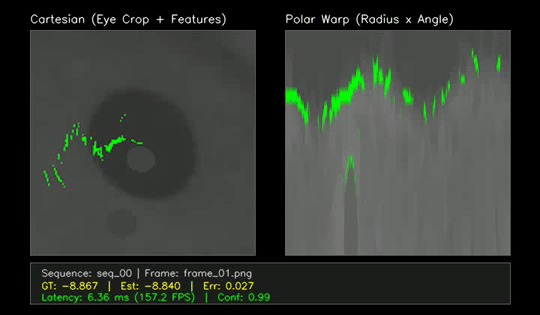

# Eye Torsion Tracking Pipeline

A high-performance C++ and Python pipeline designed to calculate and validate eye torsion (roll) angles between sequential grayscale frames. It implements polar warp transformations and masked spatial Normalized Cross-Correlation (NCC) to measure circular shifts with sub-degree and sub-pixel accuracy, even in the presence of bright specular reflections (glints).

## Demo Video

Below is the optimized tracking pipeline running on consecutive frames:



---

## Final Results

Below are the final evaluation metrics and latency benchmarks for the production configuration (Release Build running 50 sequential frame pairs):

### 1. Tracking Accuracy

| Evaluation Metric | Value |
| :--- | :---: |
| **Mean Absolute Angular Error (MAAE)** | **`0.0476°`** |
| **Root Mean Squared Angular Error (RMSAE)** | **`0.0759°`** |
| **Maximum Error** | **`0.2564°`** |


### 2. Performance & Throughput
* **Overall Mean Frame Latency**: **`3.31 ms`** (equivalent to **`302 FPS`**)
* **Execution Stage Breakdown**:

| Stage Name | Mean Latency | Min Latency | Max Latency |
| :--- | :---: | :---: | :---: |
| **1. Glint Removal** | `0.24 ms` | `0.15 ms` | `1.57 ms` |
| **2. Polar Warp** | `0.537 ms` | `0.373 ms` | `2.523 ms` |
| **3. Iris Crop & CLAHE** | `0.37 ms` | `0.26 ms` | `1.26 ms` |
| **4. Correlation Matching** | `2.16 ms` | `1.86 ms` | `4.70 ms` |

---

## Implementation Details

The tracking pipeline measures eye rotation around the visual axis using polar transformations and masked correlation matching. 

A comprehensive guide explaining the step-by-step math (Normalized Cross-Correlation, glint inpainting, polar warping, and parabolic fitting) along with intermediate pipeline visualizations is available in the [Algorithm Documentation](docs/ALGORITHM.md).

---

## Project Structure

```
├── CMakeLists.txt         # CMake build configuration (OpenCV, GTest, nlohmann_json)
├── config/
│   └── config.json        # Main configuration file (dataset paths, methods, etc.)
├── data/                  # Contains ground_truth.csv and sequence frames
├── include/               # Header files (.hpp)
├── src/                   # C++ Source files (.cpp)
├── tests/                 # Unit tests (GTest)
├── tools/                 # Python scripts for dataset setup and validation
└── venv/                  # Python virtual environment
```

---

## Getting Started

### Step 1: Environment Setup
A setup script is provided to automate the installation of system dependencies (C++ compilers, CMake, OpenCV) and the Python virtual environment setup.

Run the development setup script inside WSL/Linux:
```bash
chmod +x setup_dev.sh
./setup_dev.sh
```

### Step 2: Prepare the Dataset
The pipeline uses sequential frame pairs. A preparation script is provided to download raw eye tracking videos from Hugging Face, crop the frames around the center of the pupil, and generate synthetic sequences with exact ground-truth torsion angles:

```bash
source venv/bin/activate
python3 tools/prepare_dataset.py
```
*This extracts base frames, crops them to 160x160 pixels around the pupil center, generates rotated sequences inside `data/processed/`, and populates the ground-truth logs.*

### Step 3: Build the C++ Project
Compile the core library, main application, and test suite. You can configure build-time default diagnostics (overlay rendering logic) using the `ENABLE_DIAGNOSTICS` CMake flag:

```bash
# Build in Release mode with diagnostics DISABLED (Recommended for production):
cmake -DCMAKE_BUILD_TYPE=Release -DENABLE_DIAGNOSTICS=OFF -B build -S .
cmake --build build -j$(nproc)

# Build with diagnostics ENABLED globally by default:
cmake -DENABLE_DIAGNOSTICS=ON -B build -S .
cmake --build build -j$(nproc)
```

---

## Running the Pipeline & Validation

### 1. Run Unit Tests
Validate code correctness using GoogleTest:
```bash
./build/torsion_tests
```

### 2. Run the Main Pipeline
Process all sequential eye frames specified in `config/config.json`:
```bash
./build/torsion_app
```
*Outputs are saved under a timestamped directory inside `output/` (e.g., `output/YYYYMMDD_HHMMSS_PolarCrossCorrelation_Masked/`). This includes `algorithm_results.csv` and intermediate debug overlays (generated only for the first frame pair by default to minimize runtime overhead; this can be toggled via `request_diag` in `src/main.cpp`).*


### 3. Run Validation and Plots
Evaluate tracking accuracy against the ground truth and plot validation graphs:
```bash
source venv/bin/activate
python3 tools/validate_results.py --visualize
```
*This outputs metrics (MAAE, RMSAE, Max Error) to the console and generates visual charts matching estimated trajectories against ground-truth angles inside the latest output directory.*

---

## Hyperparameter Tuning (Optuna)

The project includes a multi-objective hyperparameter optimization script using **Optuna** to find the Pareto-optimal configurations that balance tracking error (MAAE) and execution latency (runtime).

### 1. Run the Hyperparameter Tuner
Start the tuning process by specifying the number of trials:
```bash
source venv/bin/activate
python3 tools/tune_hyperparameters.py --trials 50
```
This script will:
* Suggest hyperparameter configurations (such as polar bins, glint removal parameters, CLAHE limits, and search bounds).
* Update `config/config.json` dynamically for each trial.
* Execute the C++ pipeline target `torsion_app` in a subprocess.
* Evaluate the tracking error and latency, logging them back to Optuna.
* Log all trials to the MLflow experiment `Eye_Torsion_MultiObjective_Tuning`.

### 2. Select Best Trade-Off
Upon completion, the tuner prints the Pareto-front configurations (representing the optimal trade-offs between speed and accuracy). You can manually copy the best parameters into `config/config.json` for production use.

---

## Experiment Tracking (MLflow)

The validation script automatically tracks and logs algorithm parameters, accuracy metrics, C++ runtimes, and intermediate diagnostic images to a local MLflow server.

### 1. Start the MLflow Tracking Server
Run the local tracking server in your terminal:
```bash
source venv/bin/activate
mlflow server --backend-store-uri sqlite:////tmp/mlflow.db --host 0.0.0.0 --port 5000
```

### 2. Log Experiments
Whenever you run `tools/validate_results.py`, parameters and metrics are sent to the SQLite store:
* **Logged Parameters**: `method`, `target_fps`, `radial_bins`, `angular_bins`
* **Logged KPI Metrics**: `MAAE`, `RMSAE`, `Max_Error`, `runtime_ms` (mean C++ execution time)
* **Logged Artifacts**: Result CSVs, validation plots, and intermediate pipeline diagnostic step images (`debug_*.png`)

### 3. View Dashboard
Navigate to **`http://localhost:5000`** in your web browser to open the MLflow dashboard, compare different run configurations, and review performance/accuracy metrics.

---

## Key Performance Indicators (KPIs)

To evaluate and optimize algorithm variants, the tracking pipeline computes four core Key Performance Indicators (KPIs) on the validation datasets:

### 1. Mean Absolute Angular Error (MAAE)
Measures the average magnitude of tracking errors across all processed sequential frames:

$$\text{MAAE} = \frac{1}{N} \sum_{i=1}^{N} |\Delta \theta_i|$$

Where $\Delta \theta_i$ is the circular difference (in degrees) between the estimated angle $\theta_i^{\text{algo}}$ and the ground truth angle $\theta_i^{\text{gt}}$:

$$\Delta \theta_i = \text{atan2}\left(\sin(\theta_i^{\text{algo}} - \theta_i^{\text{gt}}), \cos(\theta_i^{\text{algo}} - \theta_i^{\text{gt}})\right)$$

### 2. Root Mean Squared Angular Error (RMSAE)
Measures tracking error variance, penalizing larger error spikes more heavily:

$$\text{RMSAE} = \sqrt{\frac{1}{N} \sum_{i=1}^{N} (\Delta \theta_i)^2}$$

### 3. Maximum Error
Captures the worst-case failure mode in the sequence:

$$\text{Max Error} = \max_{i} |\Delta \theta_i|$$

### 4. Mean Frame Latency & Throughput
Measures the average time taken by the core C++ algorithm to process a single frame pair:

$$\text{Throughput (FPS)} = \frac{1000}{\text{Mean Frame Latency (ms)}}$$

