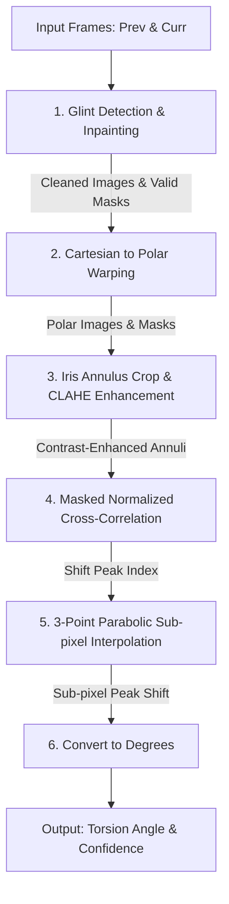
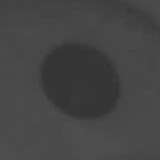
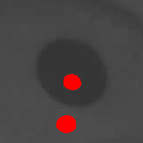
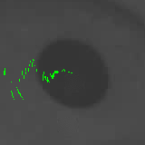

# Eye Torsion Tracking Algorithm

This document provides a detailed breakdown of the polar-cross-correlation eye torsion tracking algorithm, along with visualizations of the intermediate pipeline outputs.

---

## Algorithm Block Diagram

Below is the end-to-end data flow of the torsion calculation process:

---

## Detailed Step-by-Step Pipeline

### 1. Specular Reflection (Glint) Removal
Specular reflections from illumination sources (glints) appear as saturated white circles on the pupil and iris. If not removed, these stationary bright spots dominate the cross-correlation search, biasing the estimated torsion shift towards $0^\circ$.

1. **Detection**: Saturated pixels are thresholded (default: `149`).
2. **Dilation**: The glint mask is expanded using an elliptical structuring element (default: `11x11`) to cover transitional gradients and halos around the glint edges.
3. **Inpainting**: The marked regions are filled using **Telea's Fast Marching Inpainting Algorithm** with a designated radius (default: `5.07` pixels).
4. **Valid Mask Generation**: An inverted binary mask is generated (valid pixels = `1`, glints = `0`) to mark regions containing inpainted (artificial) values.

| Prev Cartesian (Glint-Free Inpainted) | Dilation Mask Overlay (Red) |
| :---: | :---: |
|  |  |

---

### 2. Cartesian to Polar Transformation
Since eye torsion is a rotation around the visual axis, we map the circular rotation in Cartesian space to a horizontal linear shift in polar space $(\rho, \theta)$.

Using the pupil center as the origin, the image is warped to polar coordinates:
* **Height (Rows)**: Radial distance ($\rho$, `80` bins).
* **Width (Columns)**: Angular direction ($\theta$, `720` bins, resolving to $0.5^\circ$ per bin).

| Polar Warped Image $(\rho, \theta)$ |
| :---: |
|  |

---

### 3. Iris Annulus Crop & Contrast Enhancement
To measure torsion, we isolate the iris tissue and discard the pupil and sclera.

1. **Crop**: Slices radial rows `31` to `65` out of `80` radial bins (default boundaries).
2. **Enhancement**: Applies **Contrast Limited Adaptive Histogram Equalization (CLAHE)** (default: `clipLimit = 1.19`, `gridSize = 12x12`) to boost contrast in the fibrous iris patterns while ignoring sensor noise.

| Enhanced Iris Annulus (Masked Out Glints in Red) |
| :---: |
|  |

---

### 4. Masked Normalized Cross-Correlation (NCC)
We slide the reference iris annulus horizontally against the current iris annulus over a search space of $[-26^\circ, +26^\circ]$ (which corresponds to $\pm 52$ columns for $720$ bins).

To prevent inpainted glint pixels from biasing the matching process, we calculate a **Masked NCC**. Only pixels marked as valid in both masks contribute to the score:

$$NCC(dx) = \frac{\sum_{i} \left(p_i - \bar{p}\right) \left(c_{i, dx} - \bar{c}_{dx}\right)}{\sqrt{\sum_{i} \left(p_i - \bar{p}\right)^2 \sum_{i} \left(c_{i, dx} - \bar{c}_{dx}\right)^2}}$$

Where:
* $p_i$ is the reference iris pixel value at index $i$.
* $c_{i, dx}$ is the current iris pixel shifted by offset $dx$.
* $\bar{p}$ and $\bar{c}_{dx}$ are the mean pixel values calculated over the **jointly valid mask intersection** at shift $dx$.

| Active Features Used in Correlation (Green) | Cartesian Feature Mapping |
| :---: | :---: |
|  |  |

---

### 5. Sub-pixel Peak Refinement
The discrete cross-correlation yields shifts at integer column resolutions (e.g. multiples of $0.5^\circ$). To resolve sub-degree rotation, we perform a 3-point parabolic interpolation around the peak correlation score:

Let $y_2$ be the peak score at index $x_2$, with $y_1$ and $y_3$ being the adjacent scores at $x_2-1$ and $x_2+1$:

$$\delta = \frac{y_1 - y_3}{2(y_1 - 2y_2 + y_3)}$$

The refined sub-pixel shift is:

$$\text{shift} = x_2 + \delta$$

This shift is then converted back to degrees:

$$\text{angle} = -1.0 \times \left(\frac{\text{shift}}{\text{angular\_bins}}\right) \times 360.0$$
